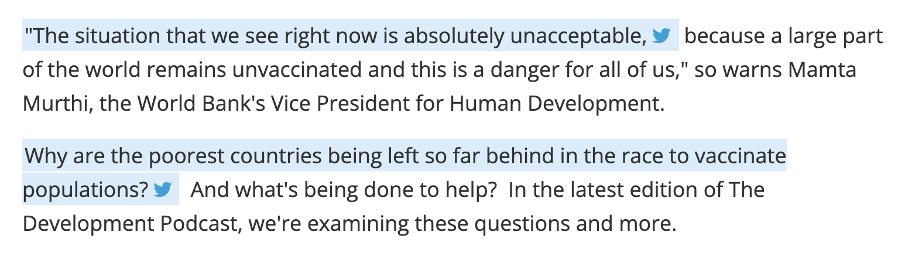
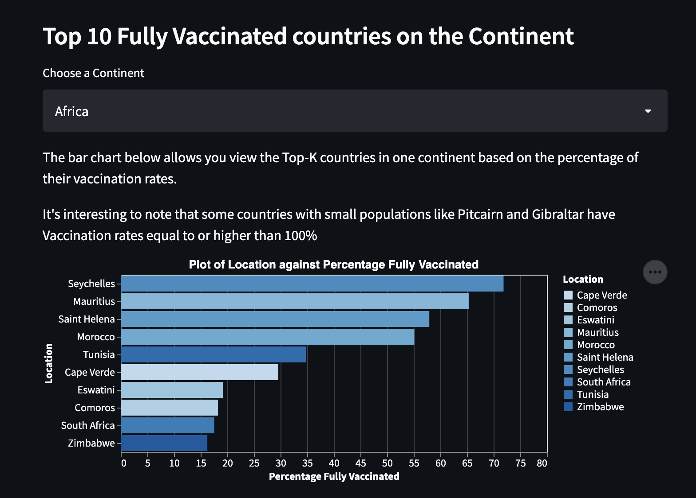

## Goals

The goal for this project was to identify and present the disparities between Vaccination rates across countries and continents across the world.

Several sources have shown that low income and developing countries have the lowest vaccination rates.

- 'Absolutely unacceptable' vaccination rates in developing countries. World Bank. (2021, August 3). 
Retrieved October 19, 2021, from https://www.worldbank.org/en/news/podcast/2021/07/30/-absolutely-unacceptable-vaccination-rates-in-developing-countries-the-development-podcast. 

- Disparities in global vaccination progress are large and growing, with low-income countries  and those in Africa lagging behind. KFF. Anderson, E. (2021, July 21). 
Retrieved October 20, 2021, 
from https://www.kff.org/coronavirus-covid-19/press-release/disparities-in-global-vaccination-progress-are-large-and-growing-with-low-income-countries-and-those-in-africa-lagging-behind/. 

To do this we first sought to answer several questions:
1. What are the Top Countries where Vaccinations were Administered?
2. What are the Vaccination Rates Across these Countries?
3. What are the Vaccination Rates Across the Continents?
4. Which Countries have the highest Fully Vaccinated Rates?
5. Does a Country's GDP play a role in the Vaccination rate across its population?
6. Is percentage of vaccinated dependent on population size of countries?

We performed some Exploratory Data Analysis to answer these initial questions but obtained more insights along the way. They are presented in our [Streamlit App](https://share.streamlit.io/)

## Design Decisions

### Dataset
We started out with a dataset obtained from Kaggle, but wanted a more up-to-date source with a higher level of credibility. We discovered that Our World In Data had a regularly updated github repo which contained all the data we could possibly want. 

Our vacination dataset was obtained from [Our World in Data's Github](https://github.com/owid/covid-19-data/blob/master/public/data/vaccinations/)

### Visual Encodings 

We mostly made use of Top-K plots and Multi-Feature scatter plots 

The Top-K plots show the staggering differences among entities 

- Example: vaccination rates in Europe vs Africa
  

  
  

The Multi-Feature scatter plots show color coded & scaled clusters of entities and the relationships between several variables 

- Example: Vaccination Rates vs Gross National Income - color coded by based on Income Levels
  

  
  

### Interaction Techniques

Initially most of our visualizations were bar graphs (not much interactivity there).
However we added some tooltips that showed additional data about the entities like countries when the bars got hovered. 

To give the user more control over what they would have liked to see, we added a multiselect dropdown widget in the sidebar to help them show similar statistics for entities of their own choosing. An example would be selecting the max number of countries to render or even the countries to compare. 

This created a form of interaction for dynamic filtering and was driven by the fact that plotting over 200 bars to represent every country would have been overwhelming or just ugly.

For our scatter plots, we added functionality for Zooming and panning to help users dig deeper into the disparities between lower and upper middle income country clusters.

### Alternatives we considered

We considered plotting every country's statistic on a seperate graph across a grid to show the difference between one-shot vaccinations and full vaccinations.

We also considered doing this with a stacked bar graph.

The decision to not pursue those visualizations was easy to make once we reviewed our project's goals.

We decided to stick with visualizations that showed disparities across countries -- not within them.

## Development Process

We started this project by performing EDA in our individual notebooks.

Using plotting libraries (altair) similar to what is available on Streamlit

### Tasks
Once we had built up some intuition for how we wanted to present the findings from our EDA, we mostly split the tasks into:

1. Further insights and plot formulation - the design of more creative/interactive plots (Rukayat)
2. Finding a second dataset for an added layer of analysis - Countries Financial Data obtained from World Bank (Rukayat)
3. Modularizing the code from the notebooks into helper functions or high level APIs (Eniola)
4. Rewriting the code in the individual EDA notebooks as one shared/merged notebook with our new APIs/util functions (Eniola)
5. Porting the code from the merged notebook to the Streamlit App (Eniola & Rukayat)
6. Writeups/elaborations on the streamlit visualizations (Rukayat)
7. Report Writing (Eniola & Rukayat)

## Logistics
### Time spent: 
  - Eniola: ~22 Hours
  - Rukayat: ~24 Hours

### Aspects that took the most time:
  - Exploratory Data Analysis (EDA)
    
    Finding the right questions to ask, and extracting answers from the data, dealing with NaNs, choosing visualizations; these were all issues we had to tackle as early as the EDA stage. We pretty much had to figure out the most important aspects of the project at this point.

### Aspects that suprisingly took the least time:
  - Getting up and running with streamlit; The APIs are brilliant!